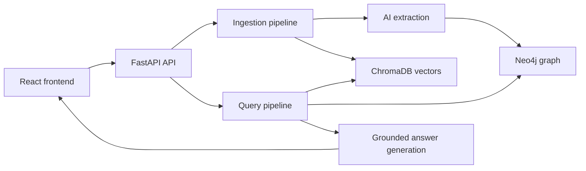

# MemoryMap: Never Lose the Why

MemoryMap is an AI-powered organizational memory platform. It turns documents and GitHub repositories into searchable evidence and a knowledge graph of people, projects, technologies, decisions, meetings, and relationships.

## Never Lose the Why

The most valuable knowledge in an organization is not only what changed, but why it changed. Decisions lose their context when meeting notes, code, discussions, and the people behind them are scattered across different systems. MemoryMap preserves that reasoning by connecting each decision to its supporting evidence, related entities, contributors, relationships, and timeline. This lets teams recover the intent behind past work instead of repeating old investigations or making decisions without the context that informed them.

## Stack

- React and Vite frontend
- FastAPI backend
- ChromaDB vector search
- Neo4j knowledge graph
- NVIDIA NIM or Ollama for AI extraction and answer generation
- GitHub commit metadata for grounded authorship and timeline facts

## How It Works

1. Select a project context in the frontend.
2. Upload documents or connect a GitHub repository.
3. Text is chunked and sent to the configured AI provider for structured extraction.
4. Entities and relationships are stored in Neo4j using deterministic IDs.
5. Chunks and project metadata are stored in ChromaDB.
6. Questions are retrieved only from the selected project, unless `All workspace` is selected.
7. Answers include evidence, related entities, and graph-based timeline facts.

GitHub authorship is taken from commit history rather than inferred from source text. Commit timestamps are stored on graph relationships and used to order timeline entries.

## Architecture



## Repository Layout

```text
Hackathon/
|-- backend/
|   |-- app/api/                 FastAPI routes
|   |-- app/database/            Neo4j and Chroma clients
|   |-- app/processors/          File parsing utilities
|   |-- app/services/            Ingestion, graph, retrieval, and AI logic
|   |-- data/chroma/             Local Chroma persistence
|   |-- data/documents/          Temporary uploaded files
|   |-- tests/
|   |-- requirements.txt
|-- frontend/
|   |-- src/pages/               Main application pages
|   |-- src/components/          Shared UI and knowledge components
|   |-- src/context/             Project and ingestion state
|   |-- src/services/api.js      Frontend API client
|   |-- package.json
```

## Prerequisites

- Python 3.11 or newer
- Node.js 18 or newer
- Neo4j, local or Aura
- NVIDIA NIM API access or a running Ollama installation
- GitHub token for repository ingestion
- Clerk application and publishable key for frontend authentication

For Ollama:

```bash
ollama pull llama3.2
ollama pull nomic-embed-text
```

## Configuration

### Backend

```powershell
cd backend
Copy-Item .env.example .env
```

Set the required values in `backend/.env`:

```dotenv
MEMORYMAP_AI_PROVIDER=nvidia
MEMORYMAP_AI_API_KEY=your-nvidia-api-key
MEMORYMAP_AI_BASE_URL=https://integrate.api.nvidia.com/v1
MEMORYMAP_AI_MODEL=nvidia/nemotron-3.5-lightning-30b-a3b
MEMORYMAP_EMBEDDING_MODEL=nvidia/nemotron-3-embed-1b

NEO4J_URI=neo4j+s://your-instance.databases.neo4j.io
NEO4J_USERNAME=neo4j
NEO4J_PASSWORD=your-password
NEO4J_DATABASE=neo4j
GITHUB_TOKEN=your-github-token
```

For Ollama, use:

```dotenv
MEMORYMAP_AI_PROVIDER=ollama
MEMORYMAP_OLLAMA_BASE_URL=http://127.0.0.1:11434
MEMORYMAP_OLLAMA_MODEL=llama3.2
MEMORYMAP_OLLAMA_EMBEDDING_MODEL=nomic-embed-text
```

If NVIDIA is selected without an API key, the backend falls back to Ollama.

### Frontend

```powershell
cd frontend
Copy-Item .env.example .env
```

Configure:

```dotenv
VITE_API_BASE_URL=http://127.0.0.1:8000
VITE_CLERK_PUBLISHABLE_KEY=your-clerk-publishable-key
```

## Run Locally

Open two terminals from the repository root.

### Backend

```powershell
cd backend
python -m venv venv
.\venv\Scripts\Activate.ps1
pip install -r requirements.txt
uvicorn app.main:app --reload
```

The API runs at `http://127.0.0.1:8000`.

### Frontend

```powershell
cd frontend
npm install
npm run dev
```

Vite normally runs at `http://localhost:5173`.

## API Endpoints

```text
GET  /health
GET  /health/neo4j
POST /api/query
POST /api/ingestion/document
GET  /api/ingestion/document/{document_id}
POST /api/ingestion/repository
GET  /api/graph
POST /graph/seed
GET  /api/ai-settings
POST /api/ai-settings
```

Example query:

```json
{
  "question": "Who worked on the RAG project?",
  "n_results": 5,
  "project_id": "rag",
  "project_name": "RAG"
}
```

When `project_id` is not `all`, Chroma applies an exact project metadata filter.

Document uploads send `project_id` and `project_name` as multipart form fields. Repository ingestion sends them in the JSON request body.

## Project Context

- New documents receive project metadata in ChromaDB.
- GitHub chunks receive the same project metadata.
- Questions send the selected project to `/api/query`.
- `All workspace` searches across all indexed projects.
- Data created before project metadata was added has no project assignment and will not appear in project-filtered searches.

## Knowledge Graph Rules

Entity IDs are deterministic hashes of normalized entity type and name. This prevents unrelated documents from merging entities merely because both used IDs such as `e1`.

Ground-truth GitHub commit metadata creates `Person -[WORKED_ON]-> Project` relationships. Relationship timestamps are stored on Neo4j edges and used by the timeline.

Validated relationship endpoint types include:

- `WORKED_ON`: `Person` to `Project`
- `EARNED`: `Person` to `Certification`
- `ATTENDED`: `Person` to `Event`, `Meeting`, or `Institution`
- `IMPLEMENTED_BY`: `Decision`, `Project`, or `Service` to `PullRequest`

## Rebuild Existing Data

Older graph data may contain ID collisions or hallucinated relationships from before the current safeguards. Code changes cannot split already-merged Neo4j nodes.

Run this in Neo4j only when you are ready to discard the current graph:

```cypher
MATCH (n) DETACH DELETE n
```

Then clear or recreate the local Chroma collection if old project metadata must also be removed, and re-ingest every source with the correct project selected.

## Testing

Backend focused suites:

```powershell
cd backend
.\venv\Scripts\python.exe -m unittest tests.test_knowledge_extractor tests.test_rag_service -v
```

Backend compilation:

```powershell
.\venv\Scripts\python.exe -m py_compile app\services\*.py
```

Frontend checks:

```powershell
cd frontend
npm run lint
npm run build
```
